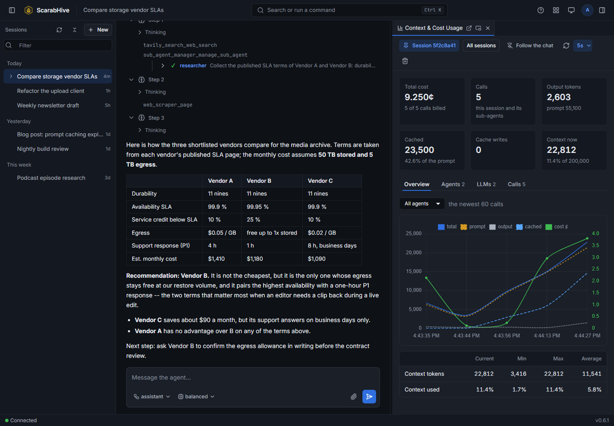
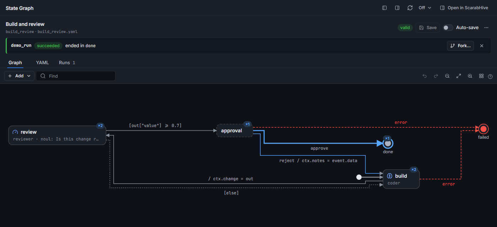
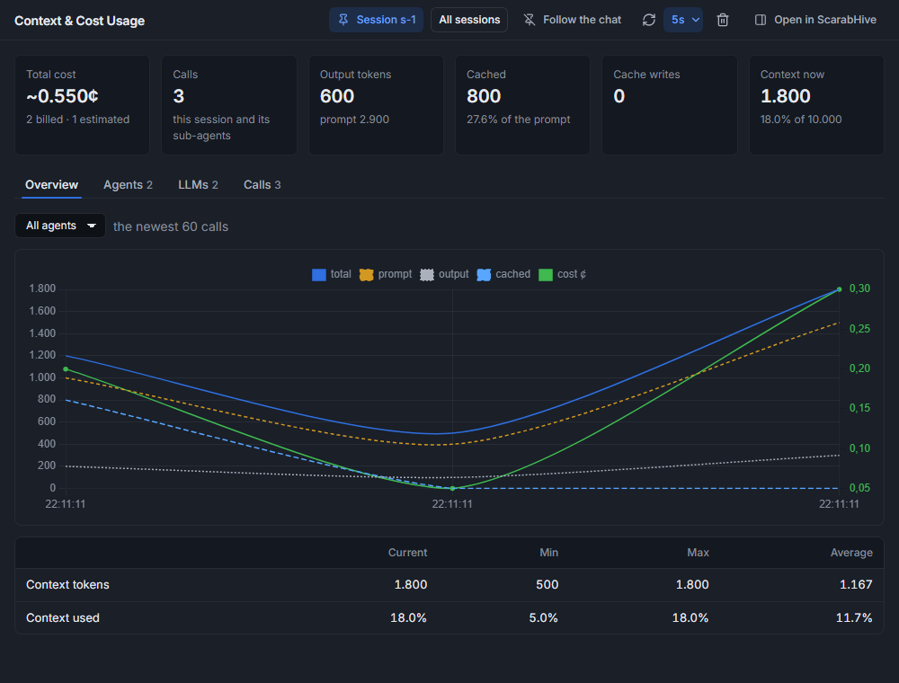
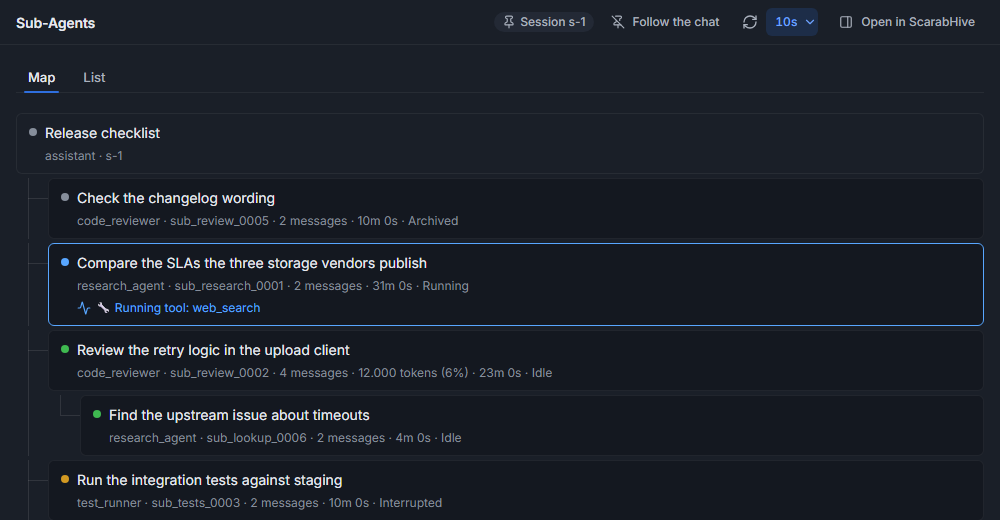
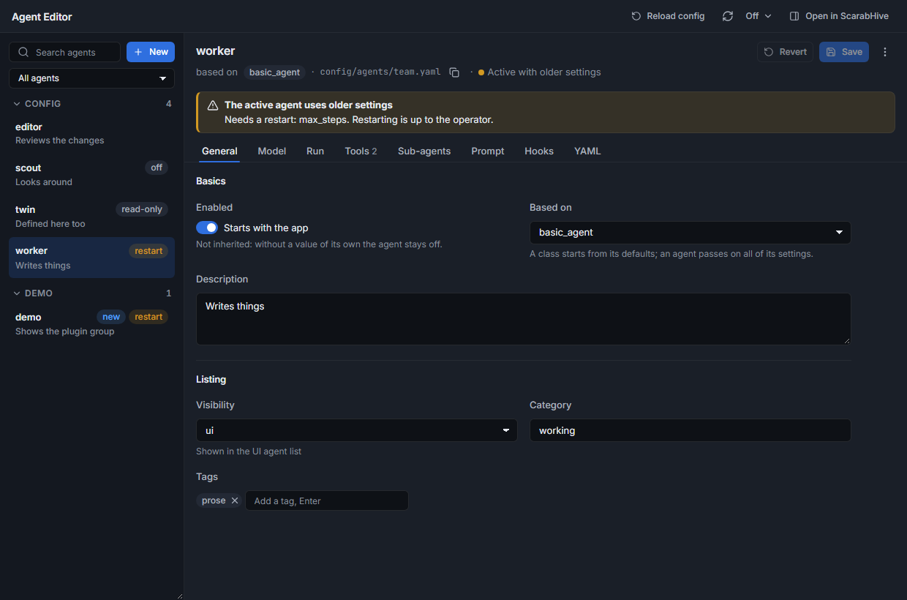
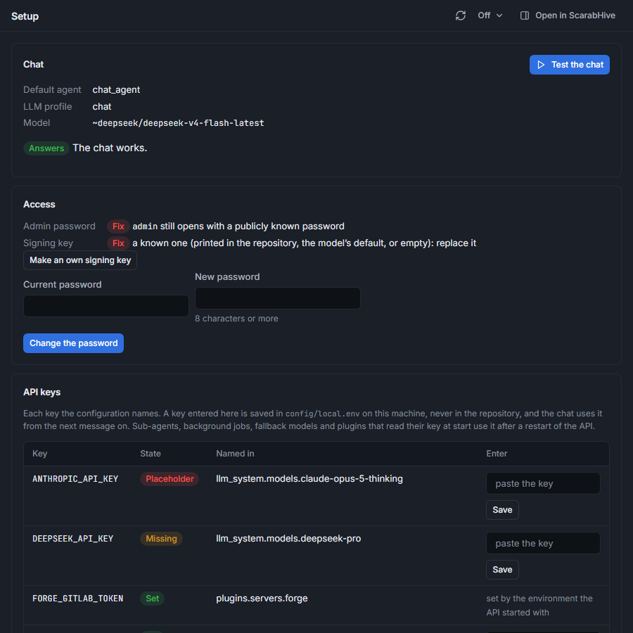

# ScarabHive

[](LICENSE)
[](https://www.python.org/)


ScarabHive is a self-hosted framework for LLM agents, built around plugins. You define an agent
in YAML: its model, its prompt and the tools it may use. You run it in the browser, from the
command line or through an OpenAI-compatible API.



> [!WARNING]
> **ScarabHive is beta software.** It is under heavy development and **may contain serious
> bugs**, including ones that lose data, run up LLM costs or weaken security. Behaviour,
> configuration and APIs can change without notice. Do not expose it to the internet or to
> people you do not trust. Keep backups of everything under `data/`, and watch your providers'
> spending limits. Please report problems (security issues privately, see [SECURITY.md](SECURITY.md)).

It is made for **developers and content creators who build agent workflows and want them to run
well**: several agents that hand work to each other, a person who approves at the right step,
and a clear view of what every call costs and why a run went the way it did.

- **Developers** write plugins in plain Python, script runs from the command line, call agents
  as models from their own code, and get a coding agent that works in their repositories.
- **Content creators** build workflows in a graph editor, with research, image, audio and video
  tools and n8n automations as steps, with little or no code.
- **Both** see every LLM request and response, the tokens, the cache hits and the cost per call,
  agent and model -- the numbers a workflow is tuned by.

**Everything is a plugin** -- tools, hooks around the model call, panels in the UI, even the LLM
providers. About 75 ship with it, and a new one is a folder with three small files.



## Built on plugins

A plugin is a folder under `src/plugins/`. It can give agents tools, run hooks before and after
each LLM call, add a panel to the UI and endpoints to the API, ship agents, prompts and skills of
its own, or add an LLM provider -- any mix of these. The core finds it by its `plugin.toml`; one
line in the configuration switches it on.

A complete tool plugin:

```toml
# src/plugins/greeter/plugin.toml
[plugin]
name = "greeter"
version = "0.1.0"
description = "Greets people."
entrypoint = "plugin:PLUGIN_FACTORY"
type = ["tool-server"]
requires = { agent_system = ">=0.6.0" }
```

```yaml
# src/plugins/greeter/schema.yaml -- what the model sees
tools:
  - type: function
    function:
      name: "{{ name }}_hello"
      description: Greet a person by name.
      parameters:
        type: object
        properties:
          who: {type: string}
        required: [who]
```

```python
# src/plugins/greeter/plugin.py -- one method per tool
from typing import Any

from agent_system.tools.schema_based import SchemaBasedToolServer


class GreeterServer(SchemaBasedToolServer):
    async def hello(self, params: dict[str, Any]) -> dict[str, Any]:
        return {"status": "success", "greeting": f"Hello, {params.get('who')}!"}


PLUGIN_FACTORY = GreeterServer
```

Switch it on in `config/plugins.yaml` (`greeter: {type: greeter, enabled: true}` under
`plugins: servers:`) and give an agent `+greeter/*` in its tool list. A tool plugin can run
several times under different names with different settings. An agent that needs no code of its
own -- a prompt, a model, some tools -- is a YAML file and no plugin at all.

More: [docs/plugin_authoring.md](docs/plugin_authoring.md), [docs/plugin_hooks.md](docs/plugin_hooks.md)
and the [example plugin](src/plugins/example/).

## What ships with it

**Agents from configuration**
- An agent is a YAML file: LLM profile, system prompt, the tools it may use (allow and deny
  patterns) and the hooks that run around each model call. There is a panel to create and edit
  them; comments in the file are kept.
- Sub-agents: an agent can start other agents, wait for them or let them run in the
  background. They keep their conversation, and a finished one can wake the caller.
- Workflows as state machines: model a workflow in a panel, run it deterministically, and
  debug it with breakpoints and watchpoints.
- Mid-run steering: a message you send while an agent works reaches it at its next step.

**Many models, one interface**
- Providers: OpenAI (Chat Completions and Responses), Anthropic, Google Gemini, OpenRouter,
  Ollama and any OpenAI-compatible endpoint. Batch APIs where the provider has one.
- Profiles with fallback chains: when a model fails or is rate-limited, the next one takes
  over.
- Every call's tokens and cost are recorded; reasoning loops are detected and stopped.

**Tools**
- Files and shell: file operations confined to configured folders; a terminal (unrestricted
  by default -- a command whitelist, or write confinement on Linux and macOS, narrows it);
  file checkpoints with undo, SSH to remote machines, scripts, SQLite queries.
- Web: search (Tavily, DuckDuckGo), page scraping, a research agent that answers with sources.
- Knowledge: memory, a todo list, lessons an agent learns from its runs, knowledge bundles in
  Markdown with a link graph (OKF), skills (packaged instructions with reference files).
- Development: a coding agent with explorer, reviewer and test-runner sub-agents; GitLab and
  GitHub (issues, merge requests, CI); Claude Code as a delegate; Godot and Blender agents.
- Media: images, audio and video into and out of the context, image composition, ComfyUI.
- Integrations: external MCP servers as tools, n8n workflows, an OpenAI-compatible API where
  every agent is a model.
- Approvals: rules per agent, and in ask mode a question to the person watching before a tool
  runs.

**Context**
- Agents that enable it get long conversations compacted and summarised, and large tool
  results moved out of the context, readable again on demand. Prompts are built so the
  provider's prompt cache keeps working.

**Web UI and CLI**
- A browser UI with a streaming chat, sessions per user and panels you dock as tabs or open
  as windows. Panels exist for setup, sub-agents, the raw LLM requests and responses, logs,
  batch jobs, lessons, memory, archived sessions, users and more.
- A Help panel with a manual for the framework and for every plugin: what the panel shows,
  each tool with its parameters, and what the model sees.
- `agent-cli` for interactive chat and one-off runs, `agent-run` for scripted runs.
- Users with roles, JWT and API-key login, route security per role.

## A look inside

| | |
|---|---|
|  |  |
| Cost, tokens and cache use of every call | The sub-agents of a session as a map |
|  |  |
| Agents edited in a form, their YAML and comments kept | Setup: what the installation still lacks |

## Getting started

You need Python 3.11 or newer (3.12 recommended), git, a few GB of disk and an
[OpenRouter API key](https://openrouter.ai/keys) — the default chat agent runs on OpenRouter.

```bash
git clone https://github.com/eehrich/ScarabHive.git ScarabHive
cd ScarabHive
sh install.sh                                           # Linux, macOS, Git Bash
powershell -ExecutionPolicy Bypass -File install.ps1    # Windows PowerShell
```

The script installs everything into `.venv`, creates a signing key for this installation, asks
for a password for the `admin` account (Enter generates one) and opens `http://127.0.0.1:8000`.
Log in as `admin`, open the **Setup** panel and enter your key.

Docker, a manual installation and troubleshooting: [INSTALLATION.md](INSTALLATION.md).

## Documentation

- [INSTALLATION.md](INSTALLATION.md) — from a checkout to the first login
- [docs/configuration.md](docs/configuration.md) — models, plugins, agents, authentication
- The **Help** panel in the UI — the manual for the framework and each plugin
  (`docs/guides/`, `src/plugins/<name>/<name>.guide`)
- [docs/plugin_authoring.md](docs/plugin_authoring.md) and [docs/plugin_hooks.md](docs/plugin_hooks.md)
  — writing your own plugins
- [docs/](docs/) — architecture and design notes

## Contributing

See [CONTRIBUTING.md](CONTRIBUTING.md). Report security vulnerabilities privately, as described
in [SECURITY.md](SECURITY.md).

## License

Apache License 2.0, see [LICENSE](LICENSE).

## Author

Enrico Ehrich
